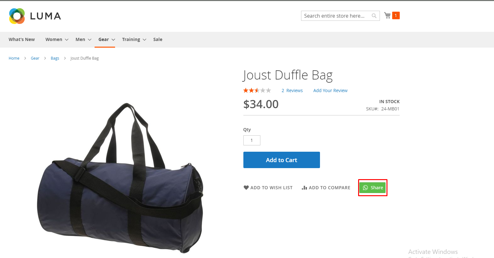

# Share on WhatsApp Extension for Magento 2

Enable your customers to effortlessly share and promote your products on WhatsApp with just one touch using our Share on WhatsApp Extension for Magento 2. This powerful extension enhances your marketing efforts by leveraging the reach of WhatsApp, ensuring your products get maximum visibility.

**[Share on WhatsApp Extension for Magento 2]**

## Key Features:

- **One-Touch Sharing:**
    Customers can share products with their WhatsApp contacts with a single click.
- **Customizable Share Message:**
    Admins can customize the default message that accompanies the shared link.
- **Seamless Integration:**
    Easily integrates with your existing Magento 2 store without any hassle.
- **Responsive Design:**
    Fully responsive and works seamlessly across all devices.
- **Button Placement:**
    Flexible options to place the WhatsApp share button on product pages.
- **Analytics Support:**
    Track the number of shares and analyze the reach and impact of your products.

## Benefits:

- **Boost Product Visibility:**
    Leverage WhatsApp's massive user base to promote your products.
- **Enhanced Customer Engagement:**
    Simplifies the sharing process, encouraging customers to share more frequently.
- **Increase in Sales:**
    Word-of-mouth marketing through WhatsApp can drive more traffic and increase sales.
- **Customizable Experience:**
    Tailor the share message to match your brand's voice and promotional strategies.

## Customer Sharing Process:

1. Navigate to the desired product page.
2. Click on the "Share on WhatsApp" button.
3. Customers can send the message to their contacts or groups.

## Compatibility:
This extension is compatible with Magento 2.x versions, ensuring seamless integration with your existing store setup.

## Installation:
**Install via composer (recommended)**
~~~~~~~~~~~~~~~~~~~~~
composer require mavenbird/whatsapp
php bin/magento setup:upgrade
php bin/magento setup:di:compile
php bin/magento setup:static-content:deploy
php bin/magento cache:flush
~~~~~~~~~~~~~~~~~~~~~

## Upgrade/Update Module:
Run the following command in Magento 2 root folder for easy update -
~~~~~~~~~~~~~~~~~~~~~
composer update mavenbird/whatsapp
php bin/magento setup:upgrade
php bin/magento setup:di:compile
php bin/magento setup:static-content:deploy
php bin/magento cache:flush
~~~~~~~~~~~~~~~~~~~~~

**Configure at Your Ease**

## Support:
Dedicated support team available to assist with installation, customization, and any other queries or concerns.
**[support@mavenbird.com](support@mavenbird.com)**

## Get Started:
Enhance your store's marketing efforts by enabling easy sharing on WhatsApp. Increase your product visibility, engage customers, and drive sales with our Share on WhatsApp Extension for Magento 2.

**Thank you!**

